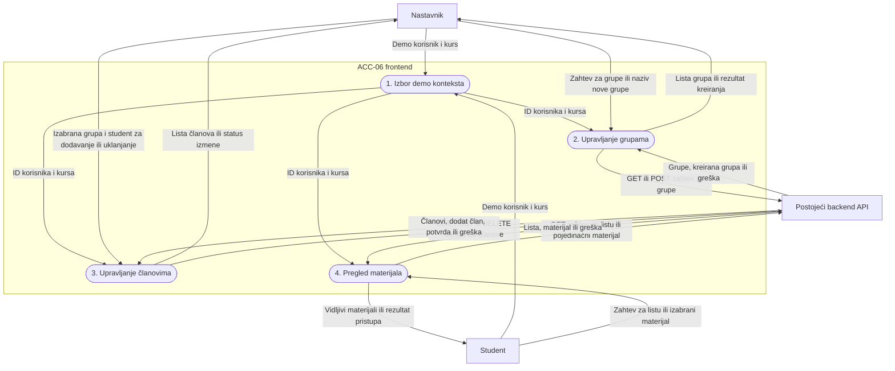

# ACC-06 — Dijagram toka podataka

Dijagram obuhvata frontend nakon uklanjanja dodele materijala grupi. Backend je postojeći servis. Baza nije prikazana jer njena struktura nije potvrđena.

```mermaid
flowchart TD
    Teacher["Nastavnik"]
    Student["Student"]

    subgraph Frontend["ACC-06 frontend"]
        Context(["1. Izbor demo konteksta"])
        Groups(["2. Upravljanje grupama"])
        Members(["3. Upravljanje članovima"])
        Materials(["4. Pregled materijala"])
    end

    Backend["Postojeći backend API"]

    Teacher -->|"Demo korisnik i kurs"| Context
    Student -->|"Demo korisnik i kurs"| Context

    Context -->|"ID korisnika i kursa"| Groups
    Context -->|"ID korisnika i kursa"| Members
    Context -->|"ID korisnika i kursa"| Materials

    Teacher -->|"Zahtev za grupe ili naziv nove grupe"| Groups
    Groups -->|"Lista grupa ili rezultat kreiranja"| Teacher
    Groups -->|"GET ili POST zahtev za grupe"| Backend
    Backend -->|"Grupe, kreirana grupa ili greška"| Groups

    Teacher -->|"Izabrana grupa i student za dodavanje ili uklanjanje"| Members
    Members -->|"Lista članova ili status izmene"| Teacher
    Members -->|"GET, POST ili DELETE zahtev za članove"| Backend
    Backend -->|"Članovi, dodat član, potvrda ili greška"| Members

    Student -->|"Zahtev za listu ili izabrani materijal"| Materials
    Materials -->|"Vidljivi materijali ili rezultat pristupa"| Student
    Materials -->|"GET zahtev za listu ili pojedinačni materijal"| Backend
    Backend -->|"Lista, materijal ili greška"| Materials
```

