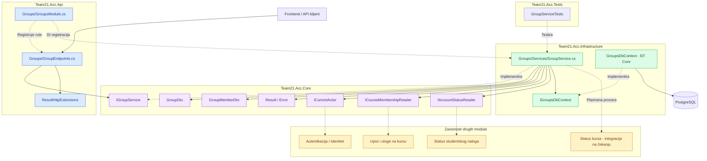

```mermaid
flowchart TB
    Client["Frontend / API klijent"]

    subgraph API["Team21.Acc.Api"]
        Endpoints["Groups/GroupEndpoints.cs"]
        Module["Groups/GroupsModule.cs"]
        ResultHttp["ResultHttpExtensions"]
    end

    subgraph Core["Team21.Acc.Core"]
        Interface["IGroupService"]
        GroupDto["GroupDto"]
        MemberDto["GroupMemberDto"]
        Result["Result / Error"]
        ActorContract["ICurrentActor"]
        MembershipContract["ICourseMembershipReader"]
        AccountContract["IAccountStatusReader"]
    end

    subgraph Infrastructure["Team21.Acc.Infrastructure"]
        Service["Groups/Services/GroupService.cs"]
        DbContract["IGroupsDbContext"]
        EF["GroupsDbContext - EF Core"]
    end

    subgraph External["Zavisnosti drugih modula"]
        Authentication["Autentikacija / identitet"]
        CourseMembership["Upisi i uloge na kursu"]
        AccountStatus["Status studentskog naloga"]
        CourseStatus["Status kursa - integracija na čekanju"]
    end

    Database[("PostgreSQL")]

    subgraph Tests["Team21.Acc.Tests"]
        UnitTests["GroupServiceTests"]
    end

    Client --> Endpoints
    Module -.->|"Registruje rute"| Endpoints
    Module -.->|"DI registracija"| Service

    Endpoints --> Interface
    Endpoints --> ResultHttp

    Service -.->|"Implementira"| Interface
    Service --> GroupDto
    Service --> MemberDto
    Service --> Result

    Service --> ActorContract
    Service --> MembershipContract
    Service --> AccountContract
    Service --> DbContract

    ActorContract -.-> Authentication
    MembershipContract -.-> CourseMembership
    AccountContract -.-> AccountStatus
    Service -.->|"Planirana provera"| CourseStatus

    EF -.->|"Implementira"| DbContract
    EF --> Database

    UnitTests -.->|"Testira"| Service

    classDef api fill:#dbeafe,stroke:#2563eb,color:#1e3a8a
    classDef core fill:#f3e8ff,stroke:#9333ea,color:#581c87
    classDef infra fill:#dcfce7,stroke:#16a34a,color:#14532d
    classDef external fill:#fef3c7,stroke:#d97706,color:#78350f

    class Endpoints,Module,ResultHttp api
    class Interface,GroupDto,MemberDto,Result,ActorContract,MembershipContract,AccountContract core
    class Service,DbContract,EF infra
    class Authentication,CourseMembership,AccountStatus,CourseStatus external
```
