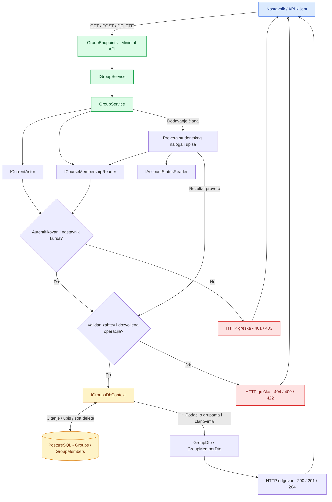

```mermaid
flowchart TD
    A["Nastavnik / API klijent"]
    B["GroupEndpoints - Minimal API"]
    C["IGroupService"]
    D["GroupService"]
    E{"Autentifikovan i nastavnik kursa?"}
    F["ICurrentActor"]
    G["ICourseMembershipReader"]
    H{"Validan zahtev i dozvoljena operacija?"}
    I["IGroupsDbContext"]
    J[("PostgreSQL - Groups / GroupMembers")]
    K["GroupDto / GroupMemberDto"]
    L["HTTP odgovor - 200 / 201 / 204"]
    M["HTTP greška - 401 / 403"]
    N["HTTP greška - 404 / 409 / 422"]
    O["IAccountStatusReader"]
    P["Provera studentskog naloga i upisa"]

    A -->|"GET / POST / DELETE"| B
    B --> C
    C --> D
    D --> F
    D --> G
    F --> E
    G --> E

    E -->|Ne| M
    E -->|Da| H

    D -->|"Dodavanje člana"| P
    P --> O
    P --> G
    P -->|"Rezultat provera"| H

    H -->|Ne| N
    H -->|Da| I
    I <-->|"Čitanje / upis / soft delete"| J
    I -->|"Podaci o grupama i članovima"| K
    K --> L

    L --> A
    M --> A
    N --> A

    classDef actor fill:#dbeafe,stroke:#2563eb,color:#1e3a8a
    classDef service fill:#dcfce7,stroke:#16a34a,color:#14532d
    classDef storage fill:#fef3c7,stroke:#d97706,color:#78350f
    classDef error fill:#fee2e2,stroke:#dc2626,color:#7f1d1d

    class A actor
    class B,C,D service
    class I,J storage
    class M,N error
```
